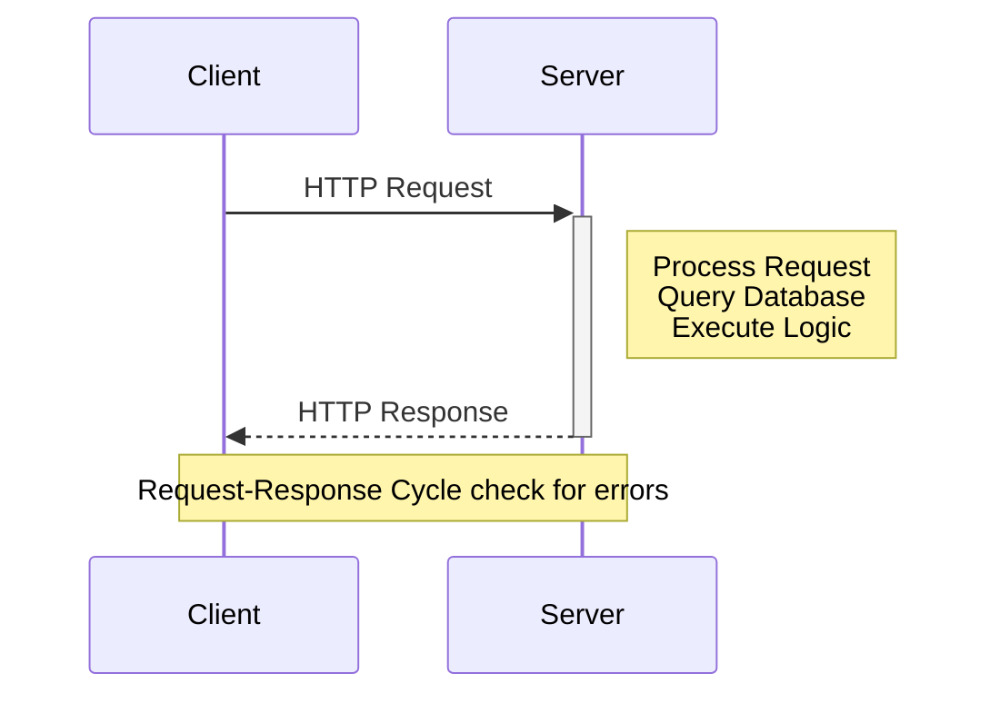

```mermaid
sequenceDiagram
    participant C as Client
    participant S as Server

    C->>+S: HTTP Request
    Note right of S: Process Request<br/>Query Database<br/>Execute Logic
    S-->>-C: HTTP Response

    Note over C,S: Request-Response Cycle check for errors

```