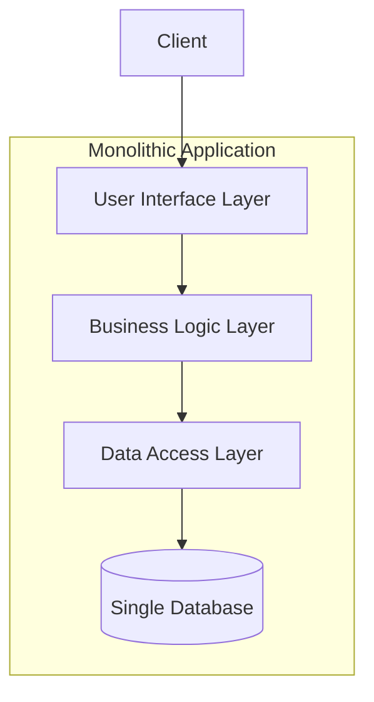
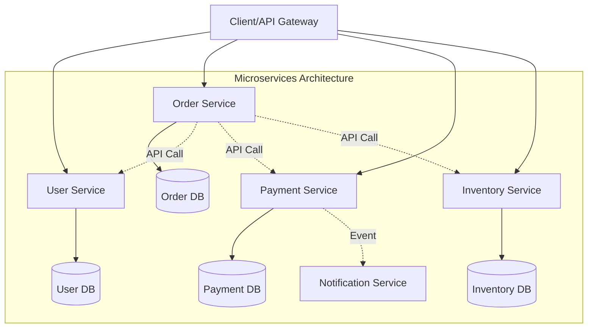
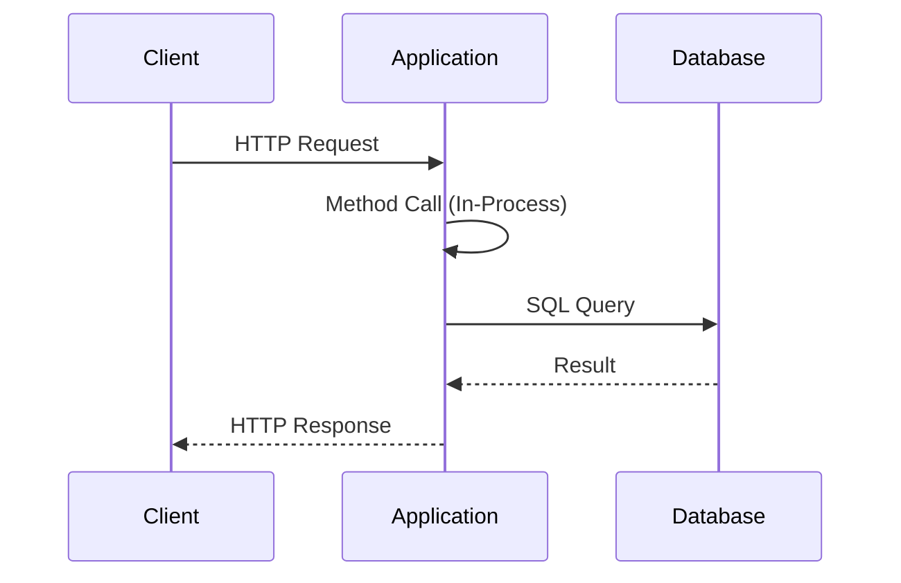
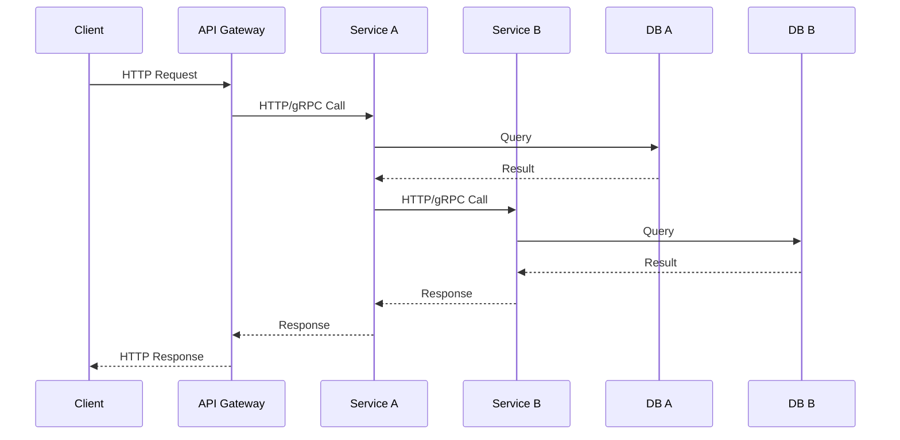

# Monolithic vs Microservices Architecture

## Overview

This document provides a comprehensive comparison between monolithic and microservices architectures, including their characteristics, advantages, disadvantages, and use cases.

---

## Monolithic Architecture

### What is Monolithic Architecture?

A monolithic architecture is a traditional software development approach where an application is built as a single, unified unit. All components—user interface, business logic, and data access layers—are interconnected and interdependent within a single codebase.

### Architecture Diagram

### Key Characteristics

- **Single Codebase**: All functionality exists in one application
- **Shared Database**: Single database for entire application
- **Single Deployment Unit**: Deployed as one package
- **Tight Coupling**: Components are highly interdependent
- **Single Technology Stack**: Entire application uses the same technologies

### Advantages

- **Simplicity**: Easier to develop, test, and deploy initially
- **Performance**: In-process calls are faster than network calls
- **Easy Debugging**: Single application makes debugging straightforward
- **Development Speed**: Faster initial development for small teams
- **Transaction Management**: ACID transactions across the entire application
- **Simpler Deployment**: One deployment pipeline

### Disadvantages

- **Scalability Limitations**: Must scale entire application, not individual components
- **Technology Lock-in**: Difficult to adopt new technologies
- **Large Codebase**: Becomes harder to maintain over time
- **Deployment Risk**: Small changes require redeploying entire application
- **Team Coordination**: Multiple teams working on same codebase can cause conflicts
- **Reliability**: Single point of failure—if one module fails, entire app can crash

---

## Microservices Architecture

### What is Microservices Architecture?

Microservices architecture is an approach where an application is composed of small, independent services that communicate over well-defined APIs. Each service is self-contained and focuses on a specific business capability.

### Architecture Diagram

### Key Characteristics

- **Distributed Services**: Application split into multiple independent services
- **Database per Service**: Each service has its own database
- **Independent Deployment**: Services can be deployed independently
- **Loose Coupling**: Services are independent and communicate via APIs
- **Technology Diversity**: Each service can use different technologies
- **Organized Around Business Capabilities**: Services align with business domains

### Advantages

- **Independent Scalability**: Scale individual services based on demand
- **Technology Flexibility**: Choose best technology for each service
- **Fault Isolation**: Failure in one service doesn't crash entire application
- **Independent Deployment**: Deploy services without affecting others
- **Team Autonomy**: Teams can work independently on different services
- **Easier Maintenance**: Smaller codebases are easier to understand and modify
- **Continuous Deployment**: Faster release cycles

### Disadvantages

- **Increased Complexity**: Distributed systems are inherently complex
- **Network Latency**: Inter-service communication over network
- **Data Consistency**: Difficult to maintain consistency across services
- **Testing Complexity**: Integration testing is more challenging
- **Operational Overhead**: Requires sophisticated DevOps and monitoring
- **Deployment Complexity**: More moving parts to manage
- **Learning Curve**: Requires expertise in distributed systems

---

## Communication Patterns Comparison

### Monolithic Communication

### Microservices Communication

---

## Side-by-Side Comparison

| Aspect | Monolithic | Microservices |
|--------|-----------|---------------|
| **Architecture** | Single unified application | Multiple independent services |
| **Deployment** | Single deployment unit | Independent deployments |
| **Scalability** | Scale entire application | Scale individual services |
| **Database** | Shared database | Database per service |
| **Technology** | Single stack | Polyglot (multiple stacks) |
| **Development** | Simple initially | Complex from start |
| **Team Structure** | Single team or coordinated teams | Autonomous teams per service |
| **Communication** | In-process method calls | Network calls (HTTP/gRPC/messaging) |
| **Failure Impact** | Entire application affected | Isolated to specific service |
| **Transaction Management** | ACID transactions | Eventual consistency, Saga pattern |
| **Testing** | Simpler integration testing | Complex distributed testing |
| **Deployment Time** | Slower (entire app) | Faster (individual services) |
| **Initial Setup** | Faster | Slower |
| **Monitoring** | Centralized logging | Distributed tracing required |

---

## When to Use Each Architecture

### Choose Monolithic When:

- Building a new application with unclear requirements
- Small team or startup with limited resources
- Application has simple business logic
- Rapid prototyping is needed
- Team lacks distributed systems expertise
- Application won't require massive scaling

### Choose Microservices When:

- Application is large and complex
- Need to scale specific components independently
- Multiple teams working on different features
- Require high availability and fault tolerance
- Need flexibility in technology choices
- Organization is mature with DevOps capabilities
- Application requires frequent updates and deployments

---

## Migration Path

### Migration Strategy Steps:

1. **Assessment**: Analyze current monolith and identify service boundaries
2. **Incremental Extraction**: Extract one service at a time (Strangler Fig pattern)
3. **API Layer**: Implement API gateway for routing
4. **Data Separation**: Gradually separate databases
5. **Testing**: Ensure comprehensive testing at each step
6. **Monitor**: Implement observability from the start

---

## Best Practices

### For Monolithic Architecture:

- Use modular design within the monolith
- Implement clear separation of concerns
- Use dependency injection for flexibility
- Maintain good code organization
- Consider modular monolith before full microservices

### For Microservices Architecture:

- Design services around business domains (DDD)
- Implement API gateway for client communication
- Use containerization (Docker/Kubernetes)
- Implement comprehensive monitoring and logging
- Use circuit breakers for fault tolerance
- Implement distributed tracing
- Define clear service contracts
- Use asynchronous communication where appropriate

---

## Conclusion

Both architectures have their place in modern software development. Monolithic architecture is excellent for small to medium applications, rapid prototyping, and teams without distributed systems expertise. Microservices shine in large, complex applications requiring independent scalability and team autonomy.

The choice between monolithic and microservices should be based on your specific requirements, team capabilities, and organizational maturity. Many successful companies start with monoliths and evolve to microservices as their needs grow.

Remember: **Architecture is not a one-time decision but an evolutionary process.**